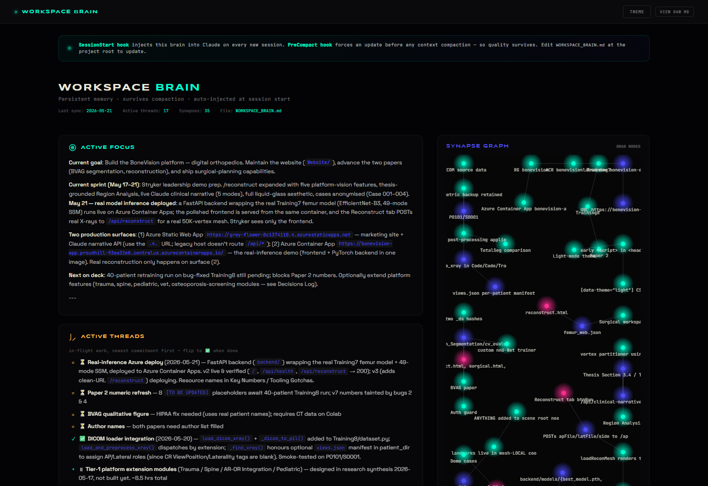
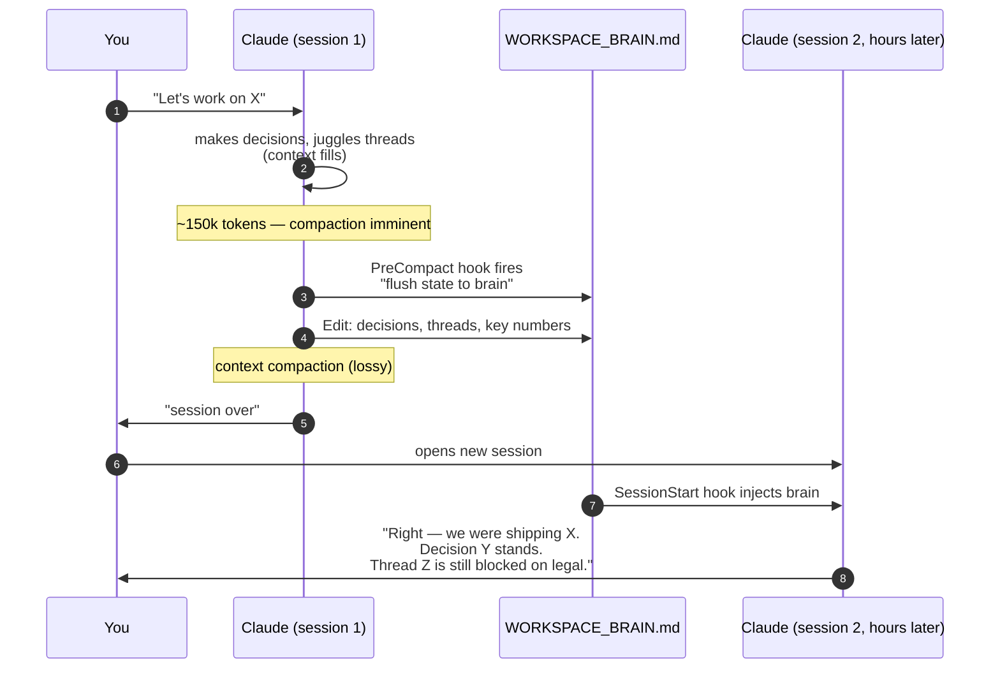

# claude-workspace-brain

> **Stop re-explaining your project to Claude every session.**
> Context compaction becomes a thing of the past.

[](LICENSE)
[](https://github.com/jim4226/claude-workspace-brain/stargazers)
[](https://github.com/jim4226/claude-workspace-brain/commits/main)
[](https://www.python.org/)
[](https://claude.com/claude-code)

<p align="center">
  
  <br />
  <em>The bundled HTML viewer (<code>template/brain-viewer.html</code>) rendering a live brain — sections, threads, decisions, and a force-directed synapse graph. Drop it into any project.</em>
</p>

**One markdown file. Two hooks. Zero dependencies.** A minimal persistent-memory layer for [Claude Code](https://claude.com/claude-code) that survives context compaction.

### What this does that other memory tools don't

- **A single markdown file you can read in a PR.** No vector DB, no embedding model, no external service, no API key required for the core to work.
- **A built-in eval harness** (`python -m eval.abtest`) that *measures* whether the brain helps your sessions. Other memory tools claim value; this one quantifies it.
- **An interactive HTML viewer** bundled in the template. `python -m http.server` and your brain becomes a live dashboard with a force-directed synapse graph.

---

## How it Works



Two hooks:

| Hook | Fires when | What it does |
|------|-----------|--------------|
| **`SessionStart`** | Every new, resumed, or post-compaction session | Reads `WORKSPACE_BRAIN.md` and injects it as Claude's first context. |
| **`PreCompact`** | Just before Claude Code compresses the conversation | Emits a directive telling Claude: "update the brain now, before working state collapses." |

The brain file is hand-curated (with Claude's help). The hooks make sure it gets *read* at the start and *updated* before loss.

---

## Quick Start

### Install (one line, in your project directory)

**macOS / Linux:**
```bash
curl -sSL https://raw.githubusercontent.com/jim4226/claude-workspace-brain/main/install.sh | bash
```

**Windows (PowerShell):**
```powershell
irm https://raw.githubusercontent.com/jim4226/claude-workspace-brain/main/install.ps1 | iex
```

Both bootstrap by cloning the repo into a cache directory and copying the template (8 files, ~30 KB) into your current project. Idempotent: re-running merges with your existing `.claude/settings.json` rather than clobbering it.

### Initialize (60 sec)

```
> /brain-init
```

Claude asks 6 questions (project type, current sprint, one in-flight thread, one recent decision + reason, one open question) and scaffolds a personalized brain. Most projects score 70+ on the linter immediately.

### Done

Your next session starts with `Loading workspace brain...` in the status line, then Claude's first reply references your actual project state.

---

## Real-world usage

Built for [BoneVision](https://github.com/bonevisionlabs) (digital orthopedics research + product). Across 6 months and ~200 sessions:

- Brain currently runs ~230 lines / 26 KB
- 20 decisions logged with rationale (the *why* survives, not just the *what*)
- Maintained 6 active in-flight threads across multiple compactions without re-explanation
- Currently scores **83/100** on its own linter (honest — it's slightly over the soft size budget)

That's not a benchmark, it's a maintenance story. The repo's value is that it keeps quality up *across* the compaction boundary, not that it tops a leaderboard.

---

## What You Get

```
your-project/
├── WORKSPACE_BRAIN.md          # the brain itself - edit this
└── .claude/
    ├── settings.json            # wires up the hooks (merged if you had one)
    ├── hooks/
    │   ├── brain_session_start.py    # injects brain at session start
    │   ├── brain_pre_compact.py      # nudges Claude to flush before compact
    │   └── brain_stop.py             # opt-in opportunistic flush
    ├── commands/
    │   ├── brain.md                  # /brain        - view + edit
    │   ├── brain-init.md             # /brain-init   - scaffold in 60 sec
    │   ├── brain-archive.md          # /brain-archive - auto-prune stale entries
    │   └── brain-grade.md            # /brain-grade  - AI quality review
    └── scripts/
        └── brain_lint.py             # static quality scorer
```

Plus, in the repo (not installed by default):

```
brain-viewer.html              # interactive HTML viewer — drop in project root
eval/
├── abtest.py                  # A/B harness: does the brain actually help?
├── questions.json             # 5 brain-dependent held-out questions
└── fixtures/sample_brain.md   # synthetic brain for demos
```

---

## The Brain File: Section Guide

Each section has a specific job. Keep them in this order — hooks and linter assume it.

| Section | Purpose | Good entry | Bad entry |
|---------|---------|------------|-----------|
| **ACTIVE FOCUS** | One paragraph: current goal + sprint | "Shipping Stripe webhook signing by May 21 for compliance review" | "Working on auth" |
| **ACTIVE THREADS** | In-flight work, newest first | "(in-progress) Schema migration for `users.tier` — blocked on Eng meeting" | "Various improvements" |
| **DECISIONS LOG** | Judgment calls + the **why** | "**2026-05-12**: switched from Memcached to Redis. Reason: Memcached lost data on staging restart" | "**2026-05-12**: switched to Redis" |
| **SYNAPSES** | Non-obvious cross-references | "Stripe webhook <-> `orders.fulfillment_state` enum — add value before deploying handler" | "Various coupling" |
| **KEY NUMBERS** | Stable facts asked about repeatedly | "Prod URL: api.example.com (Azure SWA, eastus2, free tier 100k req/day)" | "We use Azure" |
| **RECENT SESSIONS** | One line per session, prepend; archive past ~10 | "**2026-05-20**: fixed CSP for blob: previews, deployed v3, demo'd to Stryker" | "Did stuff today" |
| **OPEN QUESTIONS** | Unresolved. Flush when answered. | "Is legal review needed before staging or only before prod?" | "Several open items" |

**What NOT to put in the brain**: anything in `CLAUDE.md`, `git log`, code patterns, or auto-memory. The brain is for *non-derivable* state.

If your brain grows past 16 KB, the linter warns. Past 32 KB, injection is truncated. Run `/brain-archive` to migrate stale entries to `WORKSPACE_BRAIN_ARCHIVE.md`.

---

## Slash Commands

| Command | Purpose |
|---------|---------|
| **`/brain`** | Summarises the brain in ~10 lines + optionally edits a section. |
| **`/brain-init`** | Interactive Q&A flow that scaffolds a personalised brain in 60 sec. |
| **`/brain-grade`** | AI-graded quality review on 5 axes + concrete edit suggestions. Waits for approval. |
| **`/brain-archive`** | Migrates completed threads + sessions >10 entries old to `WORKSPACE_BRAIN_ARCHIVE.md`. |

---

## The Linter

```bash
python .claude/scripts/brain_lint.py
```

Six axes, 100 points total:

| Axis | Weight | Checks |
|------|--------|--------|
| Required sections | 20 | All 7 expected sections present |
| Size budget | 20 | Under 16 KB (soft) / 32 KB (hard injection cap) |
| Header freshness | 20 | `Last sync:` date within 14 days |
| Section balance | 15 | No section dominates >40% of file |
| Decision rationale | 15 | >=85% of decisions contain "Reason:" / "because" |
| Thread hygiene | 10 | Completed threads don't outnumber active >2:1; RECENT SESSIONS <=10 |

Always exits 0 — advisory, never a build blocker. No third-party deps; stdlib only.

```
brain_lint v1.0
File: WORKSPACE_BRAIN.md (230 lines, 26.1 KB, 10 sections)

Score: 83/100

Breakdown:
  [####################] Required sections       20.0 / 20
  [#######.............] Size budget              7.4 / 20
  [####################] Header freshness        20.0 / 20
  [####################] Section balance         15.0 / 15
  [##############......] Decision rationale      10.5 / 15
  [####################] Thread hygiene          10.0 / 10
```

---

## The Eval Harness — does the brain actually help?

Most memory tools claim value. This one measures it. The harness asks Claude 5 brain-dependent questions (e.g., "what's currently blocked?", "what was the most recent decision and why?") *with* and *without* the brain in the system prompt, then a judge model scores both answers blind on accuracy / specificity / usefulness (0-10 each).

```bash
export ANTHROPIC_API_KEY=sk-...
pip install anthropic
python -m eval.abtest --runs 3
```

```
abtest v1.0
  brain:        WORKSPACE_BRAIN.md (2.6 KB)
  questions:    5 held-out, 3 run(s) each = 15 pairs
  answer model: claude-haiku-4-5-20251001
  judge model:  claude-sonnet-4-6

  [1/15] current_focus       + delta=+12.0  (with=27, without=15)
  [2/15] recent_decision     + delta=+18.0  (with=26, without=8)
  ...
============================================================
Results over 15 pairs
============================================================
  Mean delta (with - without):  +14.20 / 30 pts
  95% CI:                       [+11.40, +17.00]
  Wins / ties / losses:         15 / 0 / 0
  Mean score WITH brain:        26.4 / 30
  Mean score WITHOUT brain:     12.2 / 30
  Verdict:                      Brain helps (significant at 95% CI).
```

Cost: ~$0.05-0.15 per `--runs 3` invocation. Prompt caching reduces brain-content cost by ~90% across runs. Use `--dry-run` to see the prompts without API calls.

---

## How it Compares

| Project | Storage | Setup | External deps | Has built-in eval? |
|---------|---------|-------|---------------|---------------------|
| **claude-workspace-brain** *(this)* | One markdown file | One curl\|bash | None | **Yes** |
| [Cipher](https://github.com/cipher-shell/cipher) | Vector DB | Run the Cipher server | Database layer | No |
| [coleam00/claude-memory-compiler](https://github.com/coleam00/claude-memory-compiler) | Knowledge articles, multiple files | Configure Agent SDK | Claude Agent SDK | No |
| [mem0.ai integration](https://mem0.ai/blog/claude-code-memory) | Mem0 vector DB | Account + API key | Mem0 service | No |
| [MemU](https://memu.pro) | MemU cloud | Account + API key | MemU service | No |

The trade-off is the usual one: hand-curation gives you a precise, readable artifact at the cost of effort; auto-compilation scales further but you trust the compiler. This project is for people who'd rather have 200 lines of markdown they actually trust than a knowledge base they don't — and who want to *measure* whether either is helping.

---

## Customising

The template's section list is opinionated but not sacred. Common variations (see `examples/`):

| Project type | Sections to add | Sections to drop |
|--------------|-----------------|------------------|
| Research / paper | `EXPERIMENTAL RESULTS`, `OPEN REVIEWER QUESTIONS` | (keep all) |
| Web app / SaaS | `DEPLOY STATE`, `CUSTOMER ASKS` | `SYNAPSES` (optional) |
| ML training | `RUNNING EXPERIMENTS`, `HYPERPARAMETER NOTES` | `RECENT SESSIONS` (training logs replace) |
| Solo CLI tool | (none) | `SYNAPSES`, drop to 5 sections |

If you rename a required section, the linter will mark it as missing — edit `REQUIRED_SECTIONS` in `brain_lint.py` to match.

### Tuning the injection size

```bash
# Cap injection at 8 KB (smaller for token-conscious models)
BRAIN_MAX_KB=8 claude
```

### Tuning the optional Stop hook

Off by default. Re-run the installer with `--with-stop-hook`. The hook only fires when the brain hasn't been touched in 30 minutes. Tune:

```bash
BRAIN_STOP_INTERVAL_MIN=60 claude
```

---

## FAQ

**Why a markdown file and not a JSON / SQLite store?**
Because Claude is excellent at reading markdown and the file doubles as documentation a human can skim. The brain is part of the project; it should be reviewable in a PR.

**Won't this blow up my context window?**
The default soft cap is 16 KB; the injection cap is 32 KB. At 32 KB the brain is roughly 7-9k tokens — meaningful but not catastrophic on a 200k-token window. The linter warns you well before you get close.

**What if I already have a `.claude/settings.json`?**
The installer parses both files and merges your existing `SessionStart`/`PreCompact`/`Stop` blocks alongside the brain hooks. Idempotent — re-running won't duplicate hooks.

**Can I use this with a team?**
Yes. Commit `.claude/settings.json`, the hooks, and `WORKSPACE_BRAIN.md` to your repo. Each team member's Claude session picks up the brain. Treat brain edits like code edits — review them in PRs.

**What if my project uses something other than Python?**
The hooks themselves are Python (it's the most-installed scripting language across dev environments). Rewriting them in Node / Go / Bash would be a 50-line port — PRs welcome.

**Does the brain leak to Anthropic?**
The brain content goes into Claude's context the same way every file you read does. If your brain contains secrets, that's a problem with secrets in your brain, not with the hook itself. Standard advice: don't commit secrets, don't paste secrets into Claude.

**What about the auto-memory at `~/.claude/projects/.../memory/`?**
Claude Code's auto-memory is per-user-per-project (lives outside the repo). The brain is per-repo (committed). They complement each other: auto-memory holds *your* preferences and tooling notes, the brain holds the *project's* state.

**How do I render the HTML viewer?**
```bash
# from your project root
python -m http.server 8000
# then open
http://localhost:8000/template/brain-viewer.html?path=/WORKSPACE_BRAIN.md
```
Or pass `?theme=dark` for the dark variant.

---

## License

MIT. See [LICENSE](LICENSE).

## Contributing

Issues and PRs welcome. Particularly interested in:

- Hook ports to other runtimes (Node, Bash, Go)
- Project-type-specific brain templates (the `examples/` directory)
- Linter rule refinements
- Additional held-out questions for the eval harness

See [CONTRIBUTING.md](CONTRIBUTING.md) for the workflow.

## Credits

Built for [BoneVision](https://github.com/bonevisionlabs) and battle-tested across a multi-month research + product cycle. The PreCompact hook idea was discussed in [anthropics/claude-code#43733](https://github.com/anthropics/claude-code/issues/43733). The brain-viewer's force-directed synapse graph was inspired by [Obsidian](https://obsidian.md/)'s graph view.
